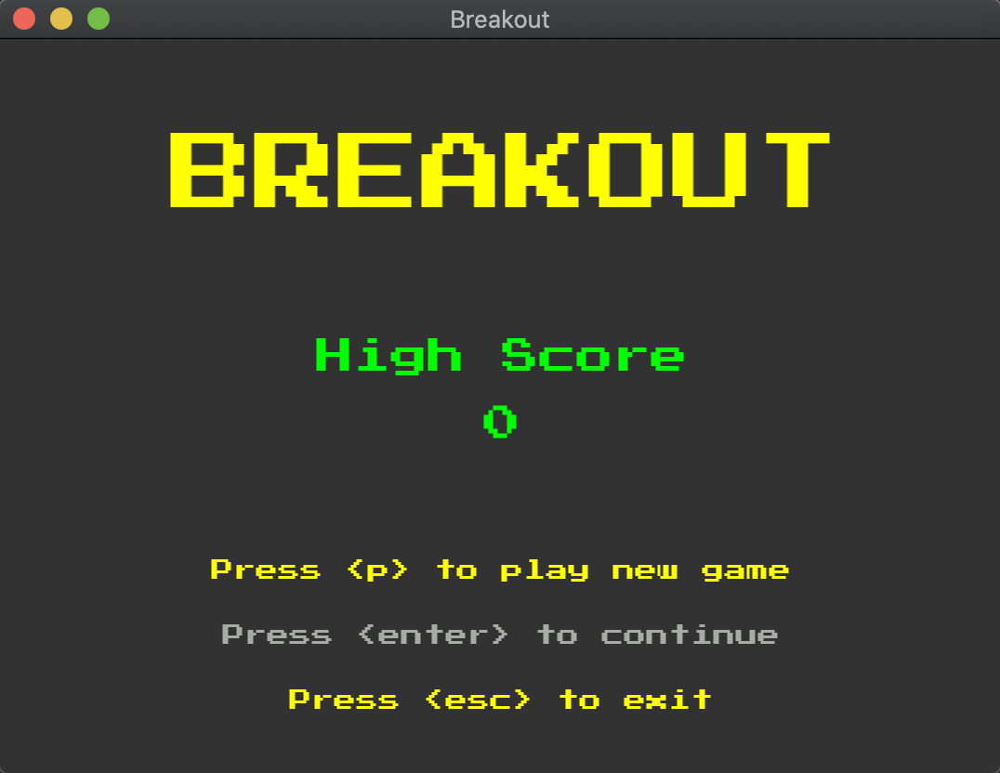
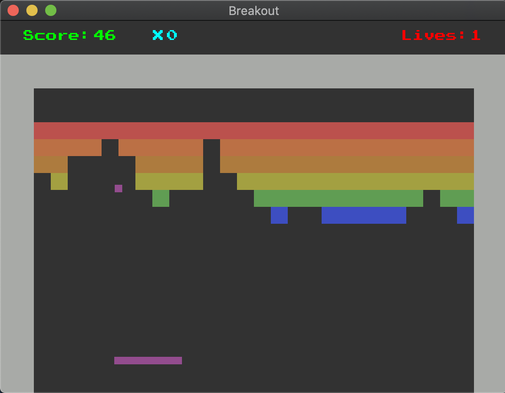

# Breakout

This game has been written in C++ using SFML as a university project inspired by its classic Atari version.

## Prerequisites
Make sure you have SFML installed on your device.

Click [here](https://www.sfml-dev.org/tutorials/2.5/ "SFML Tutorial") for more information.

## Compiling (macOS and Linux)
All you have to do is typing following commands on your terminal:

```
g++ -c *.cpp
```
```
g++ *.o -o [name] -lsfml-graphics -lsfml-audio -lsfml-window -lsfml-system
```

## Controls

* <kbd>A</kbd> : Move left
* <kbd>D</kbd> : Move right
* <kbd>Space</kbd> : Pause/Resume
* <kbd>Esc</kbd> : Exit

## Screenshots
* Menu:



* Game:


